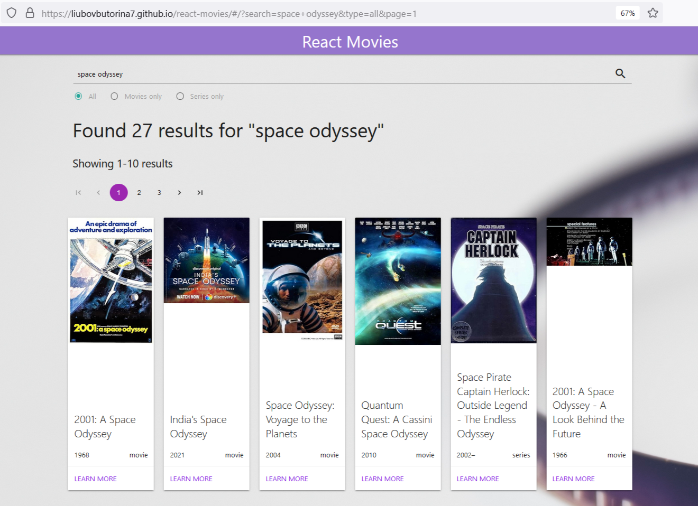
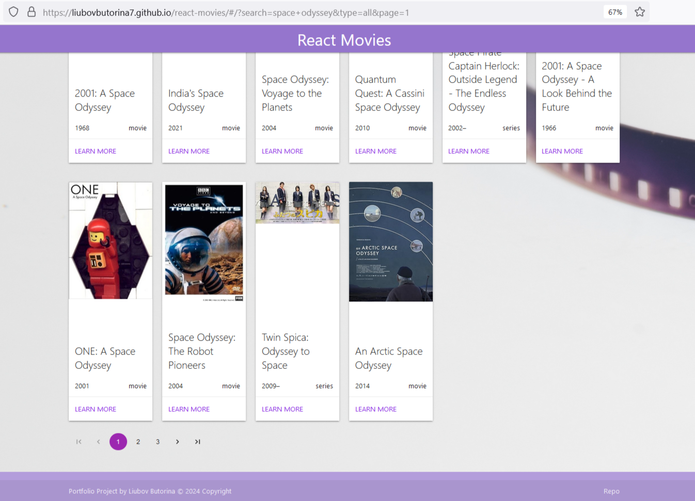
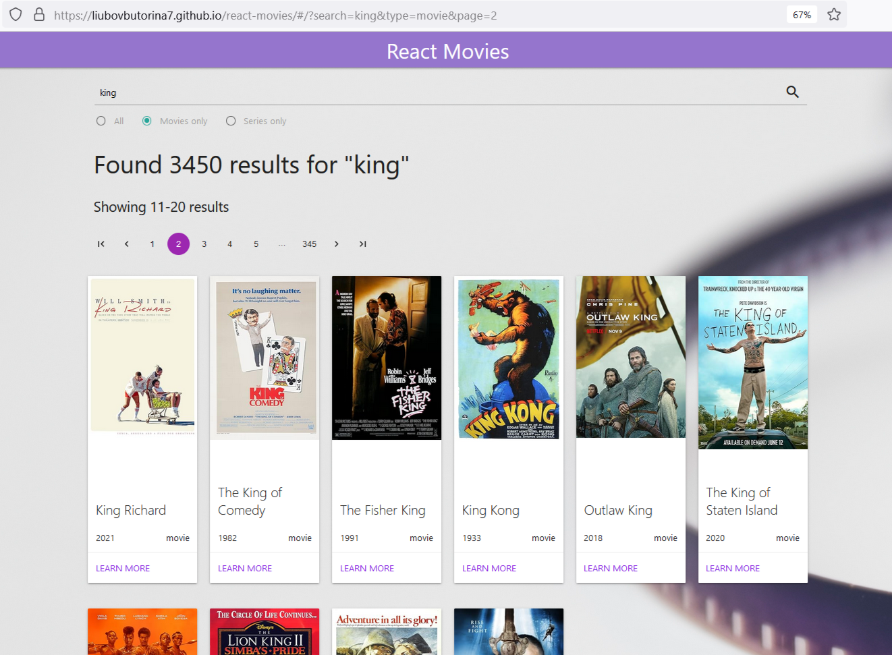
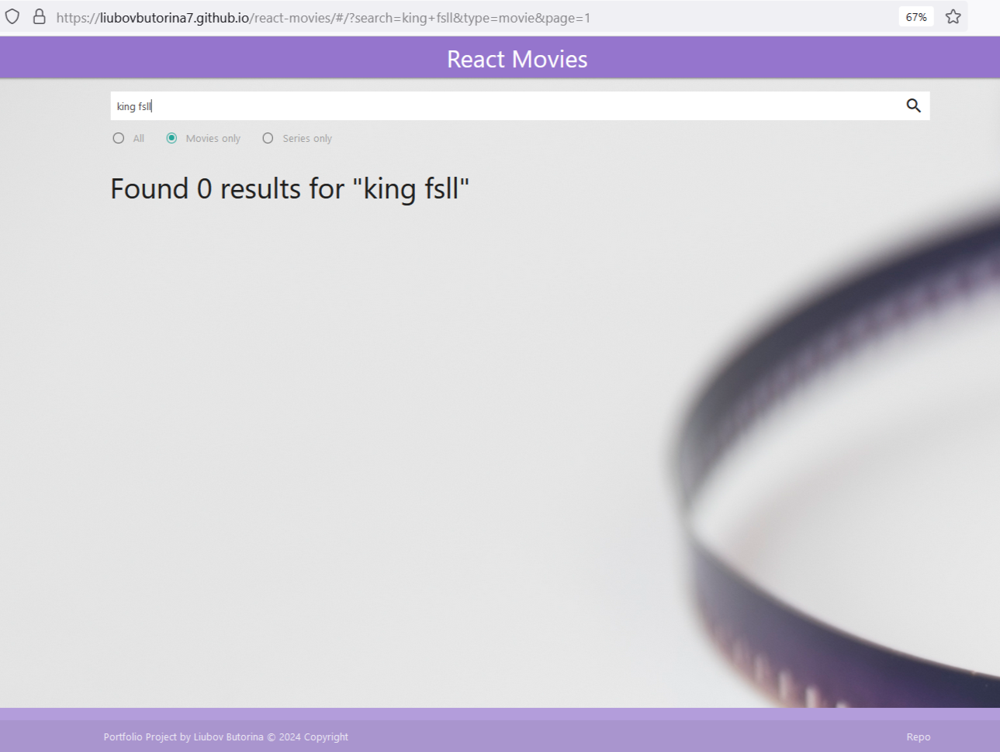
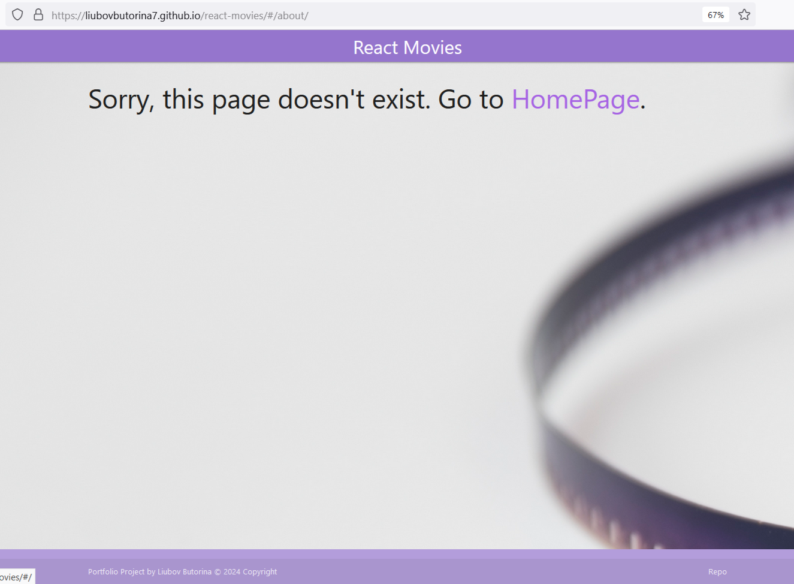
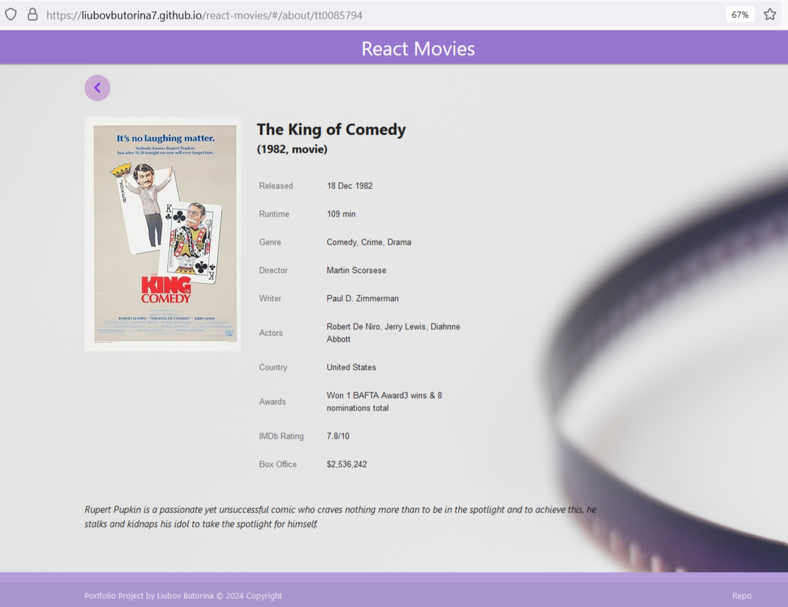
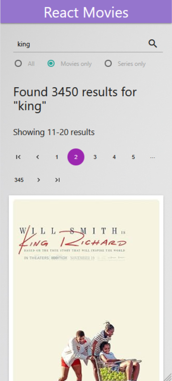
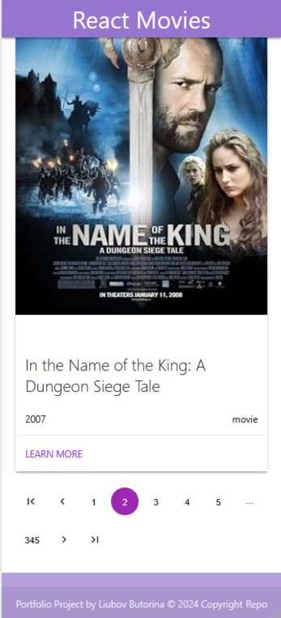
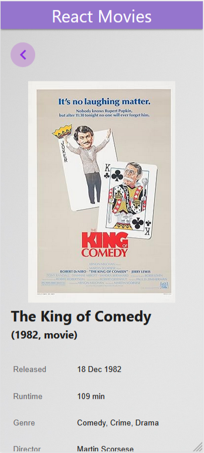
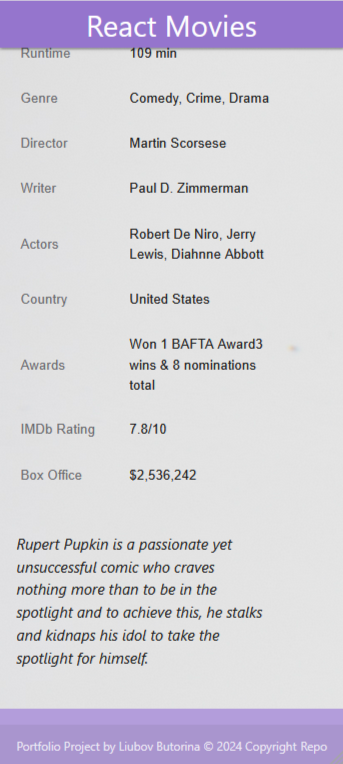

# React Movies Portfolio Project

- [DEMO](https://liubovbutorina7.github.io/react-movies/)

## Built with:

- React Create App
- React Hooks (useEffect, useReducer, useContext)
- React Router v6 
- OMDb API
- Materialize CSS
- CSS custom properties
- Flexbox
- React Pagination Component

## Resources:

- [OMDb API](https://www.omdbapi.com/)
- [Materialize CSS](https://materializecss.com/)
- [React Pagination Component](https://mui.com/material-ui/react-pagination/)

## Screenshorts:

## Author:

_Liubov Butorina_